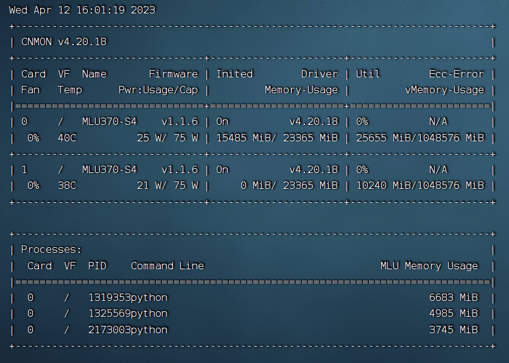

## CambriconPytorch-DeepFM
This project includes a CambriconPytorch implementation of DeepFM

## Prepare
First, you need to install all drivers on your MLU 300 series device.

Here are some advices on Ubuntu20:

        wget https://sdk.cambricon.com/static/Driver/MLU370_v4.20.18_X86_ubuntu20.04_dpkg/cambricon-mlu-driver-ubuntu20.04-dkms_4.20.18_amd64.deb

You need to install the dpkg and apt tools before installing the driver package, otherwise the driver package cannot be installed.

You need to install the dkms, gcc, and linux-header packages. Check by executing the following command:

        dpkg-query -s dkms
        dpkg-query -s gcc
        dpkg-query -s linux-headers-$(uname -r)

Install Driver via dpkg:

        sudo dpkg -i <package.deb>

When the installation is completed, the message "DKMS: install completed." is printed to indicate successful installation.

        cnmon

After the driver installation is complete, execute the cnmon command, if the driver has been installed correctly, you can see the MLU information as follows:

Second, you need a Pytorch environment for Cambricon MLU 300 series device.

Get Cambricon PyTorch docker.

        wget https://sdk.cambricon.com/static/PyTorch/MLU370_1.6_v1.10.0_X86_ubuntu20.04_python3.7_docker/pytorch-v1.10.0-torch1.6-ubuntu20.04-py37-release.tar.gz

To verify the completeness of your download package, you can use the following command for md5 checksum:

        wget https://(your_deb).deb.md5sum

Please make sure you have installed docker and obtained the appropriate permissions!

Import Cambricon Pytorch docker.

        docker load -i pytorch-v1.10.0-torch1.6-ubuntu20.04-py37.tar.gz

Third, create and run the Cambricon PyTorch container.

        export MY_CONTAINER="pytorch_py3_ubuntu2004"
        num=`docker ps -a|grep "$MY_CONTAINER" | wc -l`
        echo $num
        echo $MY_CONTAINER
        if [ 0 -eq $num ];then
        docker run -it \
                --privileged \
                --pid=host \
                --device /dev/cambricon_dev0 \
                --device /dev/cambricon_ctl \
                --name $MY_CONTAINER \
                -v /home/user/xxx/models:/home/user/xxx/models \
                -v /home/user/xxx/data:/home/user/xxx/data \
                -v /home/user/xxx/tools:/home/user/xxx/tools \
                -v /usr/bin/cnmon:/usr/bin/cnmon \
                yellow.hub.cambricon.com/pytorch/pytorch:v1.10.0-torch1.6-ubuntu20.04-py37-release \
                /bin/bash
        else
            docker start $MY_CONTAINER
            docker exec -ti $MY_CONTAINER /bin/bash
        fi

Fourth, check if your Pytorch is available.

        python
        >>> import torch
        >>> import torch_mlu
        >>> import torchvision
        >>> torch.__version__
        '1.6.0'
        >>> torch_mlu.__version__
        '1.10.0-torch1.6'
        >>> torchvision.__version__
        '0.7.0a0+489752'

## Example

        python test_mlu.py